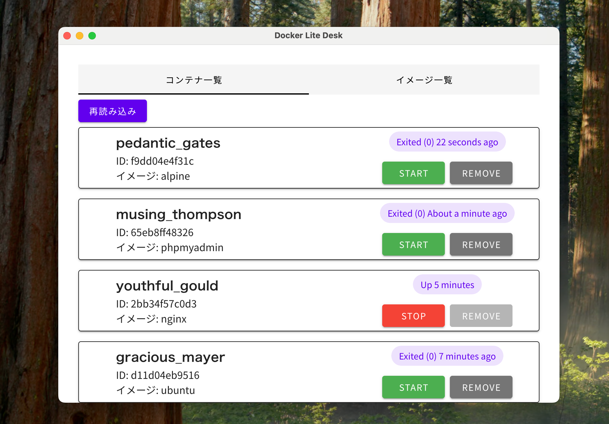
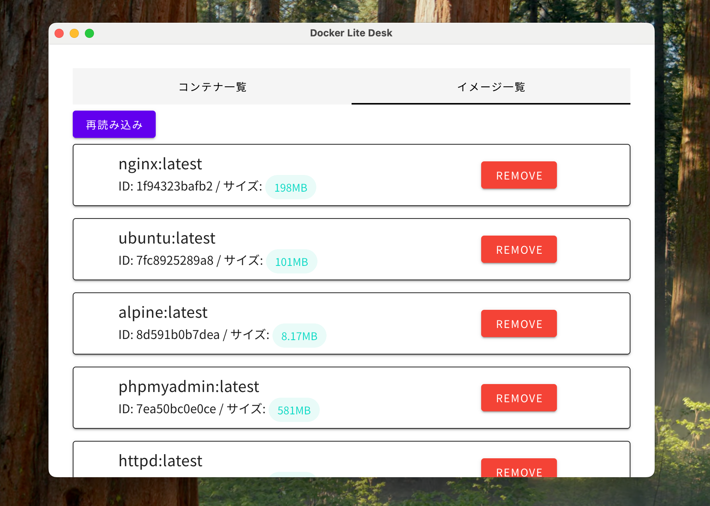

# docker-lite-desk

Multipass + Docker を操作する軽量Electronアプリケーションです。

## 特長

- Multipass VMの状態確認
- SSH経由でのDockerコンテナ制御
- `docker ps` / `docker ps -a` の実行
- イメージ一覧取得、start / stop / rm コマンド対応

## セットアップ方法

```bash
npm install
npm start
```

## 前提

- Multipass がインストール済みで `docker-vm` が存在すること
  （確認方法：`multipass list` を実行し、`docker-vm` が一覧に表示されていること）
- SSH鍵 `~/.ssh/id_rsa_multipass` が作成済みで、VM に登録されていること

## ライセンス

MIT

## スクリーンショット

実際の画面例：


